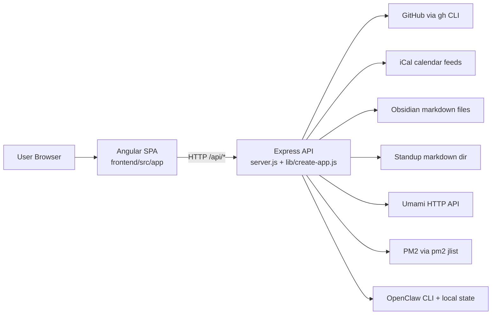
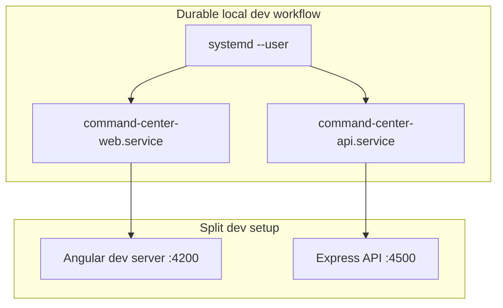
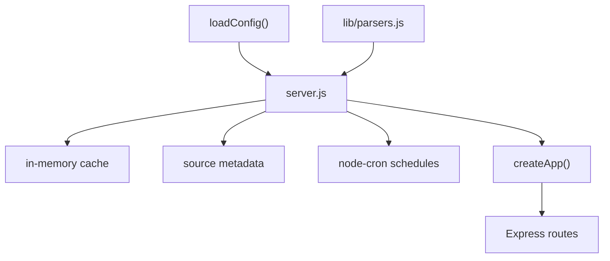
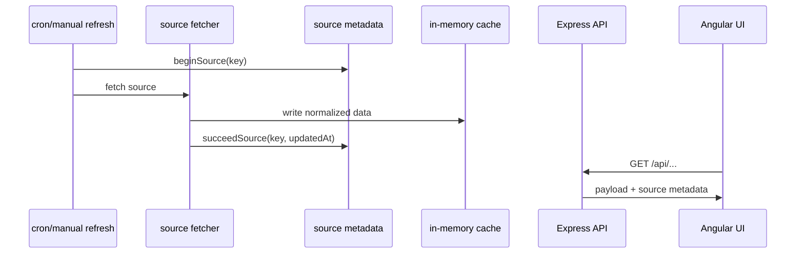
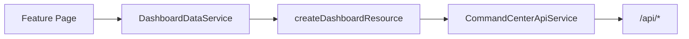
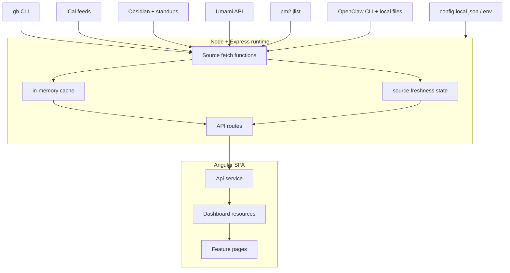

# System Design

`command-center` is a local operations dashboard that aggregates work, knowledge, runtime, and infrastructure signals into a single Angular UI backed by a Node/Express API.

This document is grounded in the current implementation, primarily:
- `server.js`
- `lib/create-app.js`
- `lib/config.js`
- `lib/parsers.js`
- `frontend/src/app/**`
- `test/*.test.js`
- `scripts/local-runtime.sh`

---

## 1. Purpose

The system exists to answer a practical question:

> What matters right now across repos, tasks, notes, runtime, and infrastructure?

It does that by:
- pulling data from local files, CLIs, and external APIs
- normalizing those sources into a small `/api/*` surface
- exposing freshness/error metadata alongside content
- presenting the results in a tabbed Angular UI
- favoring graceful degradation over hard failure where possible

---

## 2. Code map

| Area | Primary files | Responsibility |
| --- | --- | --- |
| Backend runtime | `server.js` | Source fetchers, cache, scheduling, OpenClaw helpers, bootstrap |
| Route wiring | `lib/create-app.js` | Express route definitions and response envelopes |
| Config loading | `lib/config.js` | Config discovery, merge, normalization, warnings |
| Parsing helpers | `lib/parsers.js` | Task parsing, standup parsing, daily note preview, calendar dedupe |
| Frontend data layer | `frontend/src/app/core/data/*` | Polling resources, frontend state, refresh behavior |
| Frontend API client | `frontend/src/app/core/api/command-center-api.service.ts` | Typed HTTP calls to `/api/*` |
| Feature views | `frontend/src/app/features/*` | Page-level rendering for each dashboard area |
| Durable local dev runner | `scripts/local-runtime.sh` | systemd user units for keeping dev servers alive |

---

## 3. High-level architecture

At a high level:
- the **backend** aggregates and normalizes data from many sources
- the **frontend** polls typed endpoints and renders dashboards
- most sources are **cache-backed** on the server
- a few sources, especially **Infra** and **OpenClaw**, are **live-read** at request time

---

## 4. Runtime model

There are three distinct ways the app is run.

### A. Split development mode
This is the normal interactive dev setup.

- Angular dev server on `:4200`
- Express API on `:4500`
- Angular proxies `/api/*` to the backend

### B. Built local runtime
If the Angular app is built, Express can serve the compiled frontend from:
- `frontend/dist/frontend/browser`

In that mode, Express serves both:
- `/api/*`
- the SPA shell/static assets

### C. Durable local dev workflow
`scripts/local-runtime.sh` installs two user-level systemd services:
- `command-center-api.service`
- `command-center-web.service`

This is **not** a hardened production deployment. It is a systemd-supervised way to keep the split dev processes running persistently on a local Linux machine.

---

## 5. Configuration model

Config discovery and normalization live in `lib/config.js`.

### Resolution order
1. `COMMAND_CENTER_CONFIG` if set
2. `config.local.json`
3. `config.json`
4. `config.example.json`

### What `lib/config.js` handles
The loader:
- deep-merges defaults with overrides
- expands `~` and `${HOME}`
- normalizes org/repo arrays
- derives some Obsidian paths from `vaultDir` when omitted
- emits warnings for missing optional config instead of always throwing

### Important exception: Umami
Umami credentials are **not** primarily loaded through the JSON config model. The backend reads environment variables for analytics access, including:
- `UMAMI_URL`
- `UMAMI_USERNAME`
- `UMAMI_PASSWORD`

So the system has a mixed config surface:
- JSON config for most local/dashboard concerns
- env vars for at least part of analytics auth

---

## 6. Backend architecture

The backend is centered on one large operational module, `server.js`, plus a small route/config layer.

### Core responsibilities in `server.js`
- config loading/bootstrap
- shared in-memory cache
- source freshness/error tracking
- scheduled refresh jobs via `node-cron`
- source-specific fetchers/parsers
- OpenClaw runtime inspection helpers
- server startup and app assembly

### Supporting modules
- `lib/create-app.js`: Express routes and response shaping
- `lib/config.js`: config loading and normalization
- `lib/parsers.js`: markdown/calendar parsing helpers

This is a practical aggregator architecture, not a heavily layered service architecture. Most of the operational complexity currently converges in `server.js`.

---

## 7. Source refresh and state model

Most cache-backed sources follow the same lifecycle:
1. `beginSource(key)` marks the source as loading
2. a fetcher reads/parses upstream data
3. normalized results are written into the shared cache
4. timestamps are updated
5. `succeedSource()` or `failSource()` records the outcome

### Important limitation
Source freshness is **coarse-grained**.

A source can be reported as fresh even if part of an internal loop failed, for example:
- one GitHub repo/org fetch failed but others succeeded
- one calendar feed failed but others loaded

So `fresh` should be read as:
- “the source refreshed recently”

not always:
- “every upstream sub-source succeeded completely”

---

## 8. Scheduler cadence

From `server.js`, the main scheduled refresh intervals are:
- GitHub issues: every 5 minutes
- PRs: every 5 minutes
- Notes: every 5 minutes
- Tasks: every 2 minutes
- Calendar: every 10 minutes
- Standup: every 10 minutes
- Analytics: every 15 minutes

Infra and OpenClaw are not primarily backend-scheduled in the same way. They are fetched live from request handlers, but the frontend still polls those endpoints regularly.

---

## 9. Source adapters

### GitHub
Implementation uses the `gh` CLI for:
- repo discovery
- issue listing
- PR listing
- issue mutation via close action

### Calendar
Implementation uses iCal feeds and normalizes them into upcoming event cards, including dedupe behavior from `lib/parsers.js`.

### Obsidian notes, tasks, and standups
The backend reads markdown files directly from configured directories to build:
- daily note previews
- decision summaries
- open/completed task lists
- latest standup sections

### Umami analytics
The backend authenticates against the Umami API, caches an auth token, fetches sites/stats, and aggregates totals.

### PM2 infra
The backend shells out to `pm2 jlist` and normalizes the process list into the Infra view.

### OpenClaw runtime
OpenClaw is the deepest adapter in the system. It combines:
- `openclaw status --json`
- `openclaw agents list --json`
- `openclaw logs --json`
- direct reads from `~/.openclaw/agents/*/sessions`
- direct reads from `~/.openclaw/cron/runs`
- local parsing/aggregation for sessions, recent runs, usage windows, log tails, and grouped errors

The OpenClaw path is therefore not just a CLI wrapper. It is a hybrid adapter that depends on both official command output and local state layout.

---

## 10. API design

Express routes are defined in `lib/create-app.js`.

### A. Cached read endpoints
These generally return data from the backend cache plus source metadata:
- `/api/issues`
- `/api/repos`
- `/api/calendar`
- `/api/tasks`
- `/api/prs`
- `/api/standup`
- `/api/analytics`
- `/api/notes`

### B. Live read endpoints
These do more direct request-time collection:
- `/api/infra`
- `/api/openclaw`

### C. Action endpoints
These trigger work or mutation:
- `/api/refresh`
- `/api/issues/:owner/:repo/:number/close`

### Response style
Most read endpoints return:
- `ok`
- source metadata
- endpoint-specific payload fields
- `updatedAt` when the source is cached or timestamped

The contract is consistent enough for the frontend, but it is not a single universal envelope for every route.

### Mutating-route note
The close-issue endpoint triggers a GitHub refresh, but the refresh is not fully awaited before the response returns. That means the UI can briefly observe stale issue data after a successful close.

---

## 11. Frontend architecture

The frontend is an Angular SPA organized around:
- routes/features
- shared API/data services
- shared UI primitives

### Data flow
- `CommandCenterApiService` performs typed HTTP calls to `/api/*`
- `DashboardDataService` creates reusable resource objects per source
- `createDashboardResource()` provides shared polling/loading/error/freshness behavior

### Resource behavior
Each resource exposes state like:
- current data
- source metadata
- loading / refreshing flags
- empty / unavailable flags
- a `refresh()` method

### Polling behavior
Frontend polling is **resource-local and lazy-initialized**.

A polling loop starts only when the corresponding resource is instantiated via `DashboardDataService` / `createDashboardResource()`. That means the frontend is not globally eager-loading every source at startup.

There is also a compatibility re-export path under `frontend/src/app/services/api/...`, but the main implementation now lives under `frontend/src/app/core/api/...`.

---

## 12. Frontend page composition

The feature pages fall into three broad product areas.

### Work queue
- issues
- PRs
- tasks
- done
- repos

Note: the API returns issue buckets as `urgent`, `active`, and `deferred`, while the frontend presents the deferred bucket as **Backlog** in navigation.

### Knowledge
- notes
- calendar
- standup surfaces used by Home

### Runtime and operations
- infra
- openclaw
- agents
- analytics
- home as the summary layer across all of the above

---

## 13. OpenClaw and Agents subsystem

The OpenClaw integration is both a runtime surface and a product-specific surface.

### OpenClaw runtime data
The `/api/openclaw` endpoint exposes operational data such as:
- gateway/node service state
- configured OpenClaw agents and models
- active sessions and recent runs
- usage analytics by window/model/agent
- log tail and grouped error feed

### Atlas roster UI
The frontend Agents view is a hybrid of:
- **operational truth** from `/api/openclaw`
- **static presentation metadata** from `frontend/src/app/features/sub-agents/sub-agent-registry.ts`

That distinction matters:
- **configured OpenClaw agents** come from live OpenClaw inspection
- the **Atlas worker roster** also depends on local registry metadata for naming, copy, art, and presentation

The route/component naming still reflects this history:
- implementation paths use `sub-agents`
- the visible UI presents the page as **Agents**

---

## 14. Security and trust assumptions

This app is designed for trusted local use.

### Important assumption
There is no built-in auth layer protecting the dashboard routes.

If the server is bound beyond localhost, it can expose:
- notes and task content
- calendar data
- infrastructure details
- OpenClaw diagnostics and log-derived data
- a live POST endpoint for closing GitHub issues

So the current design assumes:
- trusted local network or localhost-only exposure
- user-controlled environment and credentials

---

## 15. Current strengths

Implementation-grounded strengths include:
- a practical aggregator shape that solves a real personal ops problem
- consistent source metadata for degraded/fresh/stale UI states
- a relatively clean frontend data/resource abstraction
- parser helpers that are isolated enough to test well
- a genuinely useful OpenClaw observability layer rather than a thin status badge

---

## 16. Current risks and pressure points

### `server.js` concentration
A large amount of runtime behavior lives in one file, which increases change risk and makes isolated testing harder.

### Blocking shell dependencies
GitHub, PM2, and OpenClaw integrations rely heavily on synchronous shell calls. Slow local CLIs can stall the Node process and affect unrelated requests.

### Partial-data blindness
Some fetchers tolerate per-item or per-feed failures while still marking the whole source successful. The UI sees a coarse success/freshness signal rather than a completeness signal.

### OpenClaw adapter fragility
The OpenClaw path depends on:
- CLI JSON shape
- local filesystem layout under `~/.openclaw`
- log parsing/grouping heuristics

That is a high-change surface.

### Dual refresh cost
The architecture is simple, but it does repeated work through:
- backend cron refreshes for cache-backed sources
- frontend polling
- live-read endpoints like `/api/openclaw` and `/api/infra`

There is currently no collapsing, memoization, or rate limiting around the most expensive live reads.

### Documentation drift risk
Some names already differ by layer, for example:
- `sub-agents` vs visible “Agents”
- `deferred` vs visible “Backlog”

That makes architecture docs worth keeping close to the code.

---

## 17. Testing posture

Current automated coverage is modest but useful.

### Present today
- parser tests in `test/parsers.test.js`
- API smoke tests in `test/api-smoke.test.js`

### What this currently protects well
- markdown/task parsing behavior
- standup parsing
- daily note preview extraction
- calendar dedupe logic
- main API route shapes
- refresh route behavior
- SPA fallback behavior
- expected OpenClaw payload shape at the route boundary

### What it does **not** fully prove
- real `gh` / `pm2` / `openclaw` integration behavior
- adapter robustness under malformed upstream data
- filesystem-layout drift in OpenClaw internals
- end-to-end latency or concurrency behavior

So the current suite primarily protects parsing logic and route contracts, not the full real integration surface.

---

## 18. Likely next refactor boundaries

Without prescribing a rewrite, the most obvious next modular boundaries are:
- GitHub source module
- Calendar source module
- Obsidian source module
- Analytics source module
- OpenClaw source module
- shared cache/source-state runtime module

That would reduce pressure on `server.js` while keeping the current frontend/resource model intact.

---

## 19. System data flow summary

---

## 20. Bottom line

`command-center` is a pragmatic local operations cockpit built from:
- a cache-backed Node/Express aggregator
- a relatively clean Angular resource layer
- a set of file, CLI, and API adapters that mirror Tony’s actual workflow

Its biggest architectural strength is that it is already useful.

Its biggest architectural risk is that critical behavior, especially around source adapters and OpenClaw inspection, is concentrated in a few dense runtime paths.

The best next step is not a rewrite. It is careful modularization of the backend adapters while preserving the frontend’s current strengths.
