# Command Center screenshots

- Base URL: http://127.0.0.1:4500
- Theme: dark

## Home

Route: `/`

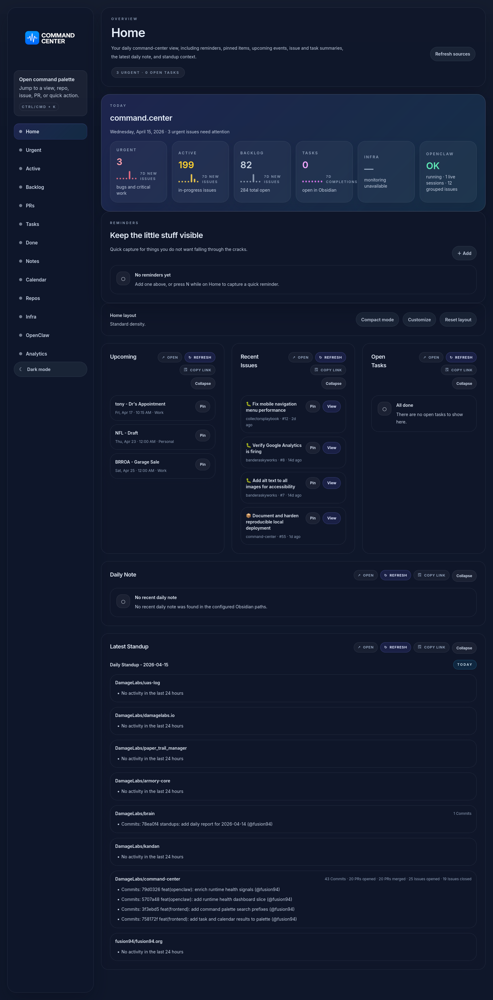

## Issues, Urgent

Route: `/issues/urgent`

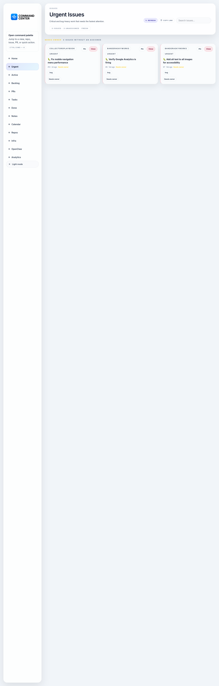

## Issues, Active

Route: `/issues/active`

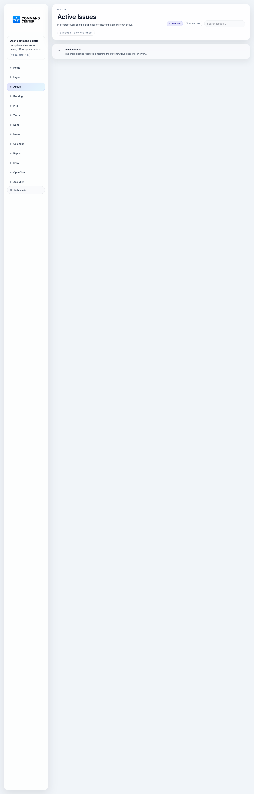

## Issues, Backlog

Route: `/issues/backlog`

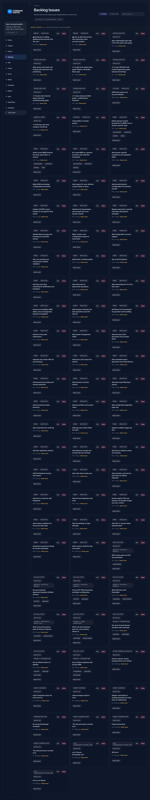

## Pull Requests

Route: `/prs`

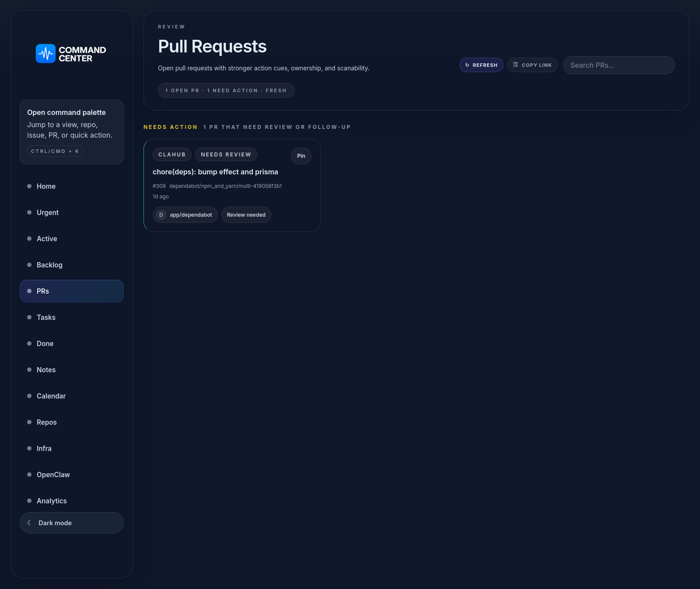

## Tasks

Route: `/tasks`

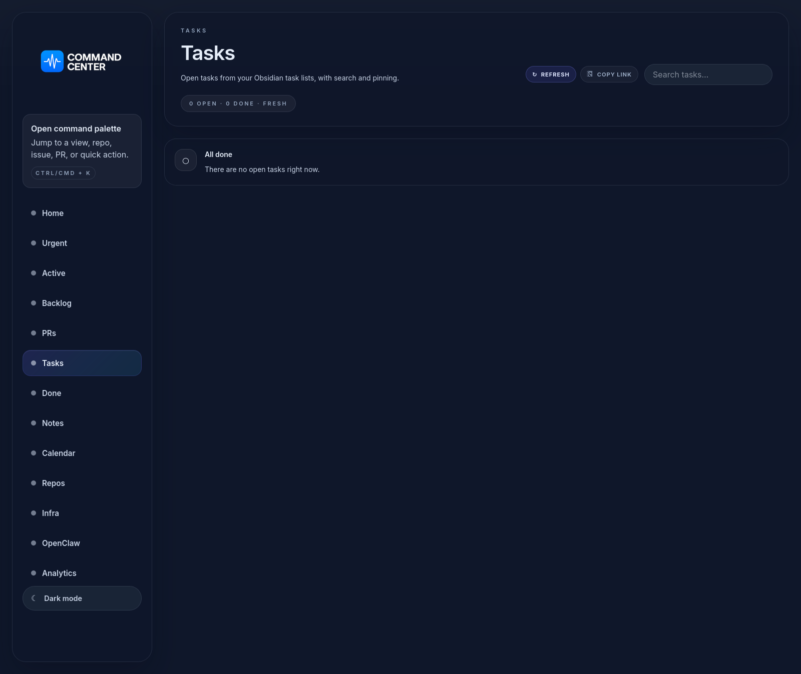

## Done

Route: `/done`

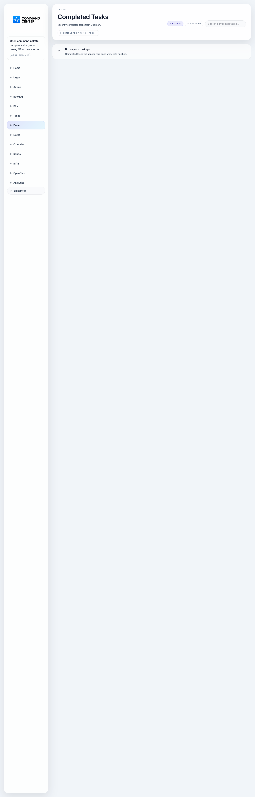

## Notes

Route: `/notes`

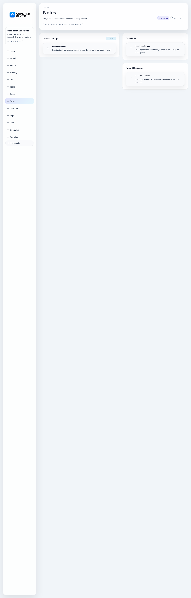

## Calendar

Route: `/calendar`

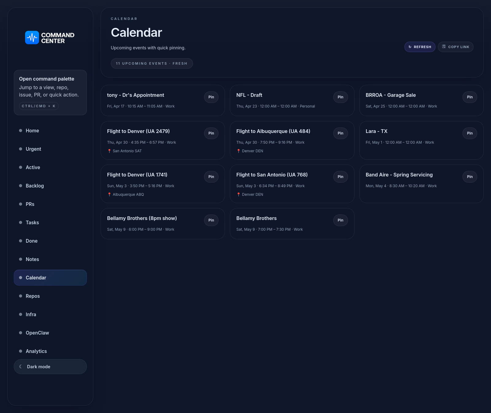

## Repositories

Route: `/repos`

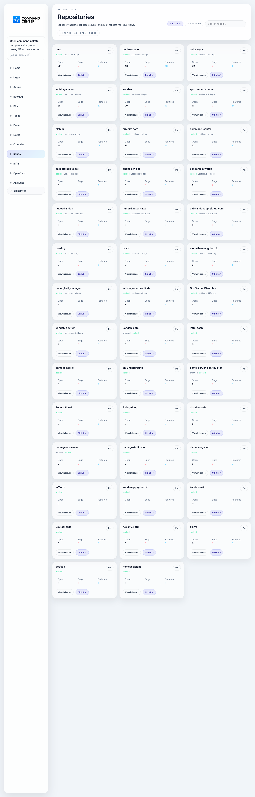

## Infrastructure

Route: `/infra`

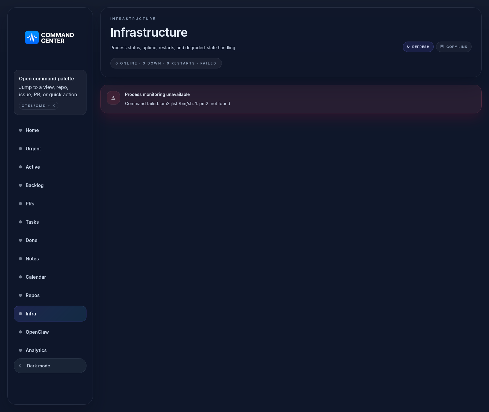

## OpenClaw

Route: `/openclaw`

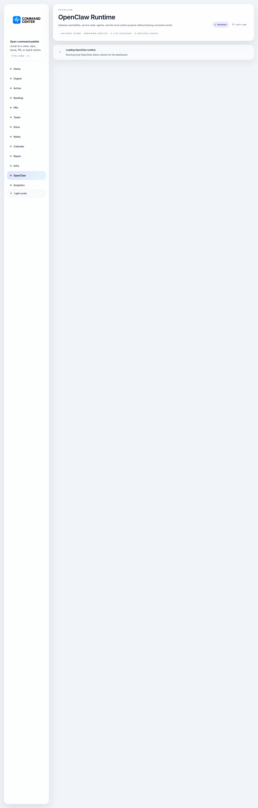
